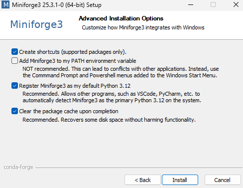

## Exercise 0: Install & Setup 

### Instructions

Before starting Exercise 1, make sure you have all necessary tools installed.

1. **(Optional) Download and install your preferred IDE (code editor) - recommended: VS Code**
   - [VS Code download](https://code.visualstudio.com/Download)
   - Install with default options.


2. **Download and install Miniforge** (Python package manager):
   - [Miniforge installer](https://github.com/conda-forge/miniforge#miniforge3)
   - Download version for your platform.
   - Install to a location without spaces in the path!
   - Install with recommended settings.
   - 


3. **Open a terminal/prompt**:
   - On Windows: Miniforge3 Prompt
   - On macOS/Linux: Terminal
   - You should see (base) environment by default
    ```bash
    (base) C:\Users\Username>
    ```

4. **Navigate to the PAPI setup folder**:
    ```bash
    cd path/to/PAPI/setup/intro
    ```

5. **Create the environment from the YAML file using mamba or conda**:
    ```bash
    mamba env create -f environment.yml
    ```

6. **Activate created environment**
    ```bash
    mamba activate papi-intro
    ```
    After activating papi-intro, your prompt should change to:

    ```bash
    (papi_intro) C:\Users\Username>
    ```
7. **Verify installation with**:
    ```bash
    mamba list
    ```

