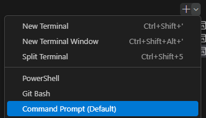

## Exercise 1: Running Your First Python Script


### Instructions

- Open a plain text editor (like Notepad) or create a new text file in your IDE (e.g., VS Code).  
- Type or copy-paste the **code** below into the new text file. 
    ```python
    # --- EXERCISE CODE ---

    # 1. Create a variable to hold a string of text
    message = "Hello from our first Python script!"

    # 2. Use the print() function to display the message in the terminal
    print(message)

    # 3. A simple calculation
    a = 10
    b = 20
    print("The sum of a and b is:", a + b)
    ```

- Save the file as `my_script.py`.  
    - *Note:* the Python interpreter can run any plain text file (`my_script.txt` will work if it contains valid code). However, `.py` is the standard extension and enables syntax highlighting, debugging, etc., in most editors.
- Open your terminal (Miniforge Prompt or integrated terminal in VS Code).  
   - In VS Code it is under: `Terminal > New Terminal`.
   - On a fresh VS Code installation, the default terminal is often PowerShell, which may cause issues with activating Conda environments. To avoid this, set Command Prompt as the Default Profile in VS Code:

    
    - Restart the terminal after changing this setting.

- *in terminal*: Activate the environment **papi-intro**
    ```bash
    conda activate papi-intro
    ```
- *in terminal*: Navigate to the folder with `my_script.py` file. 
    - For most systems, the command is: `cd path\to\folder`
- *in terminal*: Run the script by typing the following and pressing Enter: 
    ```bash
    python my_script.py
    ```  
- You should see the output printed directly in your terminal.  
    Output you should see:
    ```
    Hello from our first Python script!
    The sum of a and b is: 30
    ```
